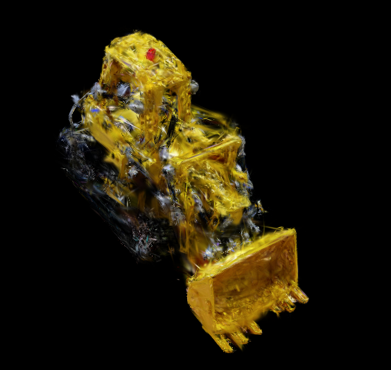

# 目标
- 目前已经可以用论文中的脚本得到粗糙的3D Gaussian模型。
- 按照论文里面的步骤，需要对3D Gaussian做初步的空洞弥补之类的优化操作。
- 这个子任务结束的标志是没有报错地运行完repair setup阶段的命令，并且得到修补后的3D Gaussian

# 工作过程
- [DONE] 运行repair_stage1
	- 结果: 
		- 运行过程中没有报错
		- 得到的3D Gaussian场景仍然很粗糙，需要进一步渲染。
		- 
- [DONE] 运行repair_stage2
	- 结果: 
		- 运行过程中没有报错。
		- 渲染效果仍然较差。
		- [Result](img2.png)
- [DONE] 安装minlora
	- 背景: 测试train_lora时发现minlora是必须安装的选项，需要手动安装这个python库。 
	- 结果: 直接用pip install安装就可以。
- [DOING] 子任务1 测试train_lora
	- 背景: 按照github里面提供的思路，这是运行leave_one_out之后的下一步。 