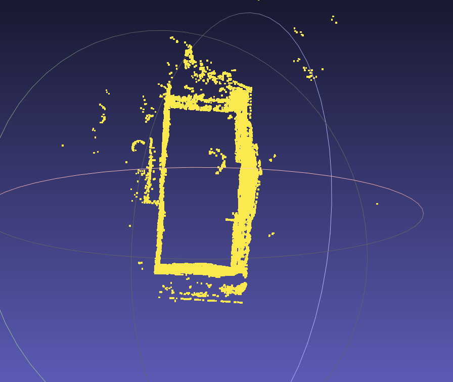

# 目标
- 用点的观察角度数量来确定无效的3D Gaussian。
- 由于目前的三维高斯结果生成的Mesh外围有很多无效的3D Gaussian，用这个结果来判定遮挡是不行的。

# 工作记录
- [DONE] 在colmap源码寻找每个三维点的有效观察视角
	- 结果: 已经在colmap源码中找到reconstruction，和OpenMVG的SfM_Data的内容基本一致。
- [DONE] 在Colmap里面写入point3D.bin的时候，同时写入一个ply形式的点云。
- [DONE] 重新运行Colmap的重建数据，然后观察未稠密化的点云的效果。
	- 结果: 得到了colmap的ply格式的稀疏点云的结果，可以发现稀疏点云中就存在大量的在房子外围的点。
- [DONE] 在colmap的点云数据中锁定这些外围点。
	- 状态:
		- [DONE] 研究发现colmap中不能像载入sfm_data.bin那样载入所有的数据。
		- [DONE] 在colmap稀疏点云计算完成后，实现了遍历所有三维点坐标并打印的功能。
		- [DONE] 在colmap刚刚完成稀疏点云计算时，遍历所有稀疏点云，锁定其中异常位置点。
	- 结果: 经过测试，可以在即将写入重建结果的时候记录这一信息。
- [DONE] 针对colmap中锁定到的外围点，观察它们的投影角度差。
	- 状态:
		- [DONE] 针对锁定到的异常点，打印它在每个图片上的投影位置。
		- [DONE] 锁定到的异常点在图片里面的位置是正常的，确实是合理的对应点，是房子周围的树木。
		- [DONE] 这个异常点的平均观察角度是60度。
		- [DONE] Colmap里面默认设置的最小观察角度是90度。
- [DONE] 调查为什么设置90度时的观察角度没有把这些点过滤掉。
	- 结果: 
		- 设置90度时确实可以把这些点过滤掉，但需要添加重建的后处理。
		- 另外，单纯设置90度还是不够严格，仍然无法将所有外部点过滤掉。
- [DONE] 设置更加严格的观察角度约束，要求至少有三组角度达到最小角度要求才允许被保留。
	- 结果: 把约束角度设置到120度，把要求的角度个数提升到6个可以解决这个问题。

# 结果
- 现在已经可以通过角度过滤掉大部分外围点了。
- 