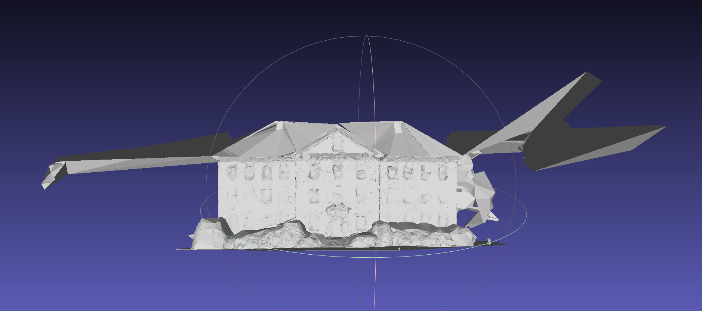

# 目标
- 把过滤过外面离散点的点云Mesh化。

# 工作过程
- [DONE] 测试将过滤后的点云直接调用泊松Mesh
	- 结果: 生成出来的Mesh是空的，说明目前的点云情况无法使用泊松Mesh。
- [DONE] 改为使用德劳内三角化生成Mesh.
	- 状态:
		- [DONE] 测试发现德劳内的Mesh函数要求的输入和泊松要求的输入不同。
			- 德劳内Mesh要求输入全部的重建相关的内容。
		- [DONE] 将重建对象作为输入传入给德劳内Mesh的函数。
	- 结果:
		- 得到的Mesh结果仍然有轻微的异常点，但这或许并不影响碰撞效果。
		- 
- [DOING] 解决得到的Mesh和3D Gaussian不在同一个坐标系的问题。
	- 状态:
		- [DONE] 发现3D Gaussian和Mesh坐标系不一样是因为OpenSplat在载入点云的时候对点云做了变换。
		- [DONE] 验证了变换关系只有平移和缩放，平移是一个(1,3)大小的Tensor，scale是一个float数值。
		- [DOING] 将变换矩阵记录下来直接应用在Mesh上，不再追究变换矩阵是怎样被计算出来的。